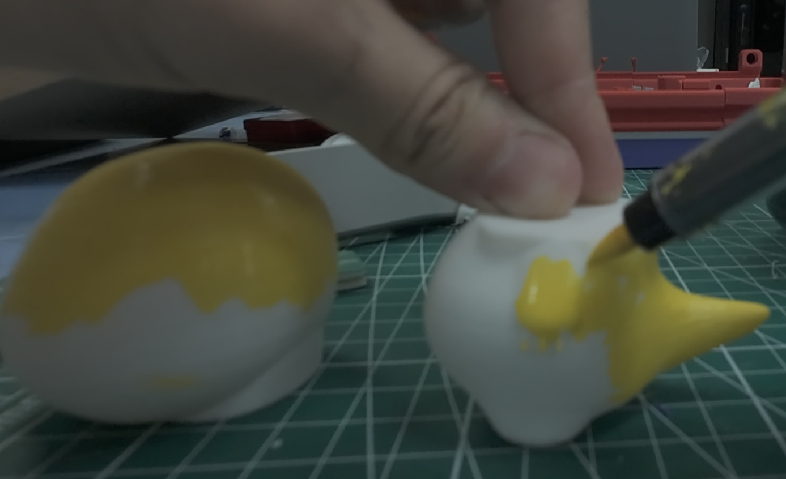
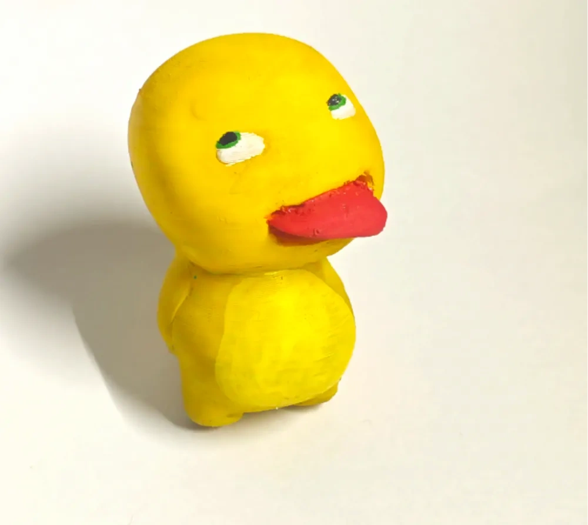
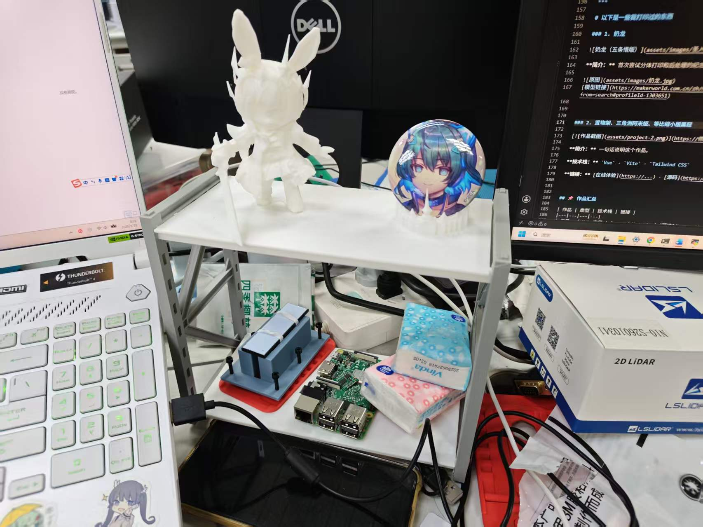
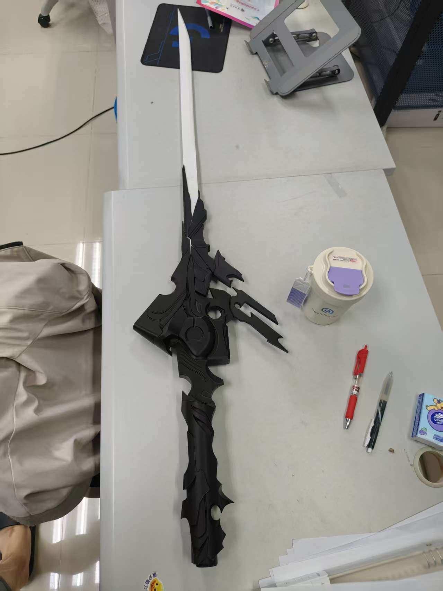
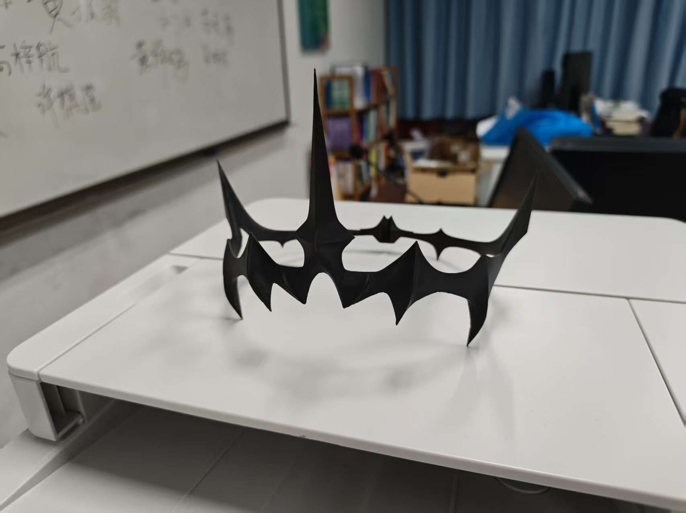
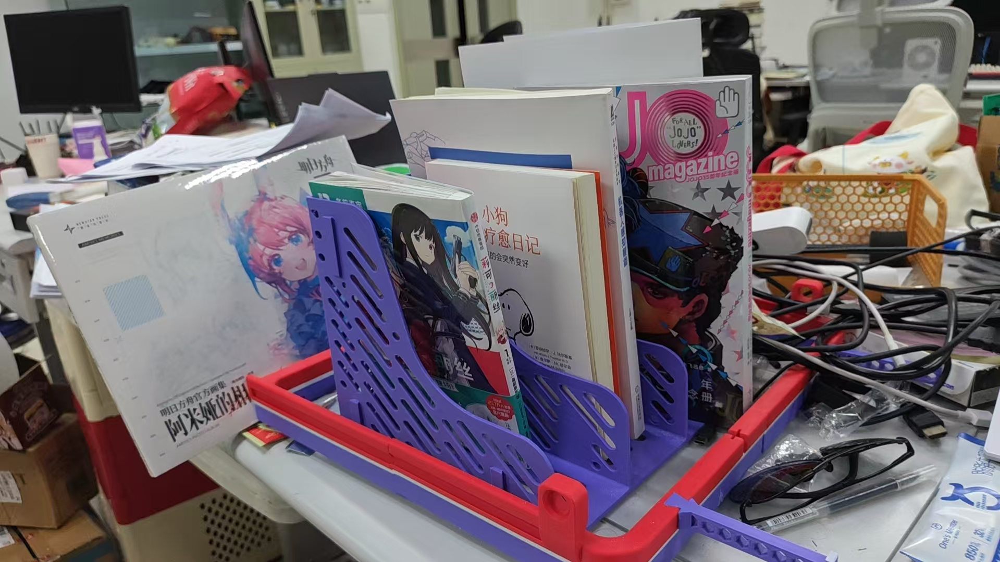

# 拓竹 P2S 和 AMS Pro 使用经验

以下是我在打印过程中解决问题的一些经验和建议。

## 1. 材料

参考视频：[3D 打印耗材选购指南](https://www.bilibili.com/video/BV1vixbewEq8/)
P2S 主要支持的材料有 PLA、PETG 和 ABS。~~（都是塑料）~~

- PLA：对湿度要求不高，但湿度太大也容易打印失败。材料本身硬度高，不耐高温，会随时间逐渐变脆，大约 2–3 年后容易脆化、折断，相对不适合做支撑件。
- PETG：容易[受潮拉丝](https://www.bilibili.com/video/BV1EF1jB4EBW)，需要让 AMS 保持高度干燥。
- ABS：**有毒**，需要通风环境，数值优秀。

**单论材料本身pla和petg几乎没有毒性，但是各个耗材厂家会往材料里加不同的妙妙小成分~~（点名拓竹！！！）~~会产生魔法烟雾，所以不要长时间待在正在工作的打印机旁边**
价格PETG ≈ PLA < ABS ,强度PLA < PETG < ABS。每种材料都有多种变体，用于满足不同的需求，如轻量化，更高的强度等。

## 2. 干燥剂

如果长期只打印 PLA，AMS耗材箱 湿度保持在 40% 以下即可。不过，湿度较高时，尤其是打印机使用超过半年、湿度在 30% 以上时，我遇到的打印失败率会提高。

AMS 自带的干燥剂撑不了太久，需要额外购买干燥剂。尝试过几种之后，我认为最好用的是分子筛，孔径优先选 13X，其次是 3A。

使用分子筛需要打印干燥盒。干燥盒有很多种，按位置分，有放在料盘里的，也有放在 AMS 缝隙里的。

此外氯化钙等其他干燥剂可以自行了解。

## 3. 联网

**不要连接校园网**（即便是已经登录校园网的路由器），否则打印机没法直接上网进而登录拓竹账号。可以使用手机热点、移动 Wi-Fi 等能直接访问公网的方式。

## 4. 打印流程

获取 3D 模型 → 放进切片软件切片 → 将模型传到打印机 → 开始打印。

### 获取模型

渠道分付费和免费。

免费渠道：makerworld（最推荐，拓竹的官方渠道），视频网站分享，自己做， ~~求别人做一个~~

付费渠道：淘宝咸鱼等电商平台，还有专门的模型网站打赏，购买时注意FDM（我们用的热熔堆积型打印机）和光固化（很丝滑但有毒且脆皮的娇贵货~~精致的毒蛇傲娇大小姐~~）的区别
  
### 切片

由模型的3mf等格式生成给打印机用到的gcode文件。

切片最好选和打印机品牌一致的软件，因此我们首选拓竹的bambu studio，可以多点点鼠标左右中键探索一下基本功能

### 上传模型文件

三种方式：u盘，电脑切片软件上传，手机app

u盘综合最好，一是不需要担心因为模型缓存超过上限把上传过的模型顶掉，二是人机分离，打印的时候不需要操作其他设备，就是需要有一个人献出一只u盘来公用

电脑打印次之，坏处是需要联网，电脑端和打印机不需要同一个网，只需要都能访问公网即可，好处是方便修改文件和监控，通过uu远程，向日葵等远控软件远程操作电脑，也可以实现一定程度的人机分离，从而不用带电脑
    
手机直接打印模型好处是简单，坏处是需要打印机联网登录，打印的模型只能来自于makerworld上传的，而且如果源文件没有切片和支撑那么打印的文件也不会有支撑~~是很多打印失败的罪魁祸首~~ ~~答应我不要用手机打印好吗会变得不幸~~ ~~集百家之短这一块~~

## 5. 支撑

讲述支撑的视频链接：待补充。

树形支撑比普通支撑省料，树形支撑里有机树最优。普通支撑上限最高，在极其容易打印失败的件上表现很好。~~想知道什么是极度容易失败可以搜一下[“文明的存续”](https://makerworld.com.cn/zh/models/1304391-ming-ri-fang-zhou-wen-ming-de-cun-xu-hei-guan?from=search#profileId-1400574)这个模型~~。

支撑图案方面，树形支撑都是中空的，普通支撑用默认的直线即可。

此外可以学一下[手动绘制支撑](https://www.bilibili.com/video/BV1MBKnzzEuB/)，对解决倒件倒支撑等问题很有帮助

## 6. 稀疏填充

讲述各种稀疏填充图案强度的视频链接：[图案和强度关联的直观演示](https://www.bilibili.com/video/BV1SdrHBUEB4/)

社区公认的结论是，螺旋体是综合最优的图案，没有特殊情况就统一用螺旋体。

## 7. 打印速度

拓竹默认的打印速度和加速度，用来打印精度要求不高的工程件完全ok。但对于容易失败的精细件，以及手办等对表面质量有要求的件，默认参数偏激进。

可以在打印开始后换到静音模式，用 50% 速度打印；也可以在切片时降低加速度、打印速度、空驶速度等参数，以提高成功率和表面质量。

## 8. 高质量打印

视频链接：  
-[【教程】如何用FDM打印高质量手办模型](https://www.bilibili.com/video/BV17C411E7Hp/)。  
-[ 我第一次调喷口参数踩过的坑](https://www.bilibili.com/video/BV1af421d7r4)

这一条仅供参考，**绝大多数情况下，我们用不到手办这么高质量的模型。**常见做法有：

- 把层高设为最小。这会显著增加打印时间。
- 开启回抽。回抽参数的调整比较吃经验，容易遇到拉丝，需要调整辅助散热风扇等参数来配合。
- 打开”避免跨越外墙“等参数可以减少模型表面的小坑，也能提高成功率
- 设置外墙，顶层墙
- 调整模型的摆放角度或设置[可变层高](https://www.bilibili.com/video/BV1g5LizCEd1/?bd6189)，进而控制层纹并减少打磨等需求；
- 使用树形支撑，或者调整支撑的接触面，减少表面瑕疵。也可以用不同材料分别打印模型和支撑，但和多色打印一样费时费料。还可以了解一下[水溶性支撑](https://www.bilibili.com/video/BV14r42147qf/)~~（纯粹的数值和纯粹的贵）-链接~~。
- 避免模型接触热盘的部分不够光滑：让模型离开热盘，用支撑托起来；也可以直接在切片软件里创建一个[容易去除的简单立体图形](https://www.bilibili.com/video/BV1Ni7nzcEWy)，把模型顶起来。另一种办法是换用更好的热盘。
- [调整顶层、底层图案，提高表面质量](https://www.bilibili.com/video/BV1xcuTzMECg)。比如圆柱形物体，可以选同心圆作为顶面图案。
- 接缝则尽量藏在模型不容易看见的地方。
- [把复杂模型切开，分成多次打印](https://www.bilibili.com/video/BV1SHSyYgEmF)，打磨后再拼起来。没有原始 3D 打印文件时，也可以在切片软件里做简单拆分。
- 打磨工具从粗到细有笔刀、锉刀、砂纸、海绵砂纸、金刚石研磨液等。PLA 打磨时容易泛白，需要加水打磨。修补和拼接可以用补土、UV 胶等，部分材料有毒。[参考链接](https://www.bilibili.com/video/BV1Fok8YvE8x)
- 也可以用抛光液腐蚀模型表面，但抛光液有毒。
-任何抛光手段都会损失细节，需要做权衡。

如果这些方法仍然不能满足打印质量要求，可以搜索光固化打印机。

## 9. 多色打印

多色打印的原理是 AMS 不断往热头里换料。每层打印时，只要换颜色，就需要冲刷掉旧颜色。每次冲刷都会消耗大量耗材，也会极大延长打印时间。

所以，**非必要不做多色打印**。~~答应我不要因为直接打手办或者打礼物送给男女朋友浪费大量料好吗~~

如果是可以通过模型摆放来做到每一层颜色都一样，比如一个法国国旗这样的简单多色物体，那么多色打印不成问题。~~可以打白模再自己上色~~

不同颜色的同类材料堆在一起不会影响强度，因此不需要担心料不够用换料再打会有问题。
## 10. 换料

进料可以从AMS里进料也可以用外挂料，外挂料是最最基础的方式，远不如AMS方便和稳定，不做讨论 。

换料时容易踩的坑，是**纸筒的凹槽没有对准料盘的凸起**。大力出奇迹把料盘装上后，可能会发现料盘圈圈的缝一面宽、一面窄，不是一个圆形。

轻则料盘转不动，AMS拉扯导致耗材变形、挤出机过载，也就是第 12 条里提到的高频问题；重则料盘弹开导致耗材炸卷。

## 11. 耗材炸卷

炸卷就是耗材失去料盘束缚后散开。

如果这卷料已经用掉比较多，还可以揉回去，再把料头理出来。料头一定要理清，否则缠住其他部分，也会导致耗材卡住、变形。

如果这卷料还没用掉多少，散开后可能连料盘都盖不回去。这种情况我建议**直接丢掉**，因为整理要花太多时间，不太值得。

## 12. 堵头、卡料和挤出机过载

维修视频链接：[拆喷头和复原的方法](https://www.bilibili.com/video/BV1sodSBXELE/)。

有耐心也可以翻官方的问题定位手册，内容有些长。

很多时候，挤出机过载是因为耗材变形，齿轮无法咬住耗材，进而空转，导致既不能进料，也不能退料。

这时可以按下 AMS 后面和喷头上面的料管释放按钮，拔出对应的铁氟龙料管，把变形的耗材抽出并去掉，再重新插好料管、进料即可。

## 13. 打印失败的应对方案

先检查支撑，然后是速度，温度，材料等参数的设置，最后是检查机器的挤出机，热头，隔热套等问题

**在打印前打开视频记录可以帮助99%的问题的定位**~~还可以留下有意思的视频~~

通过减少失败进而减少料子的浪费是一件有公德的事~~这么看我挺没公德的~~ ~~耗材报销很麻烦的球球你们省着点用吧~~

## 14. 维护

打印机会定期提示待维护事项，扫描二维码，照着内容操作即可。随货工具箱里的工具和耗材，用来保养一年以上不成问题。

日常使用时需要保持箱体内部的整洁，碎屑过多会导致热盘很脏，影响成功率，或者卡住皮带丝杆等部件出现故障

可以打印一个很大的竹屎盒并且定期清理掉竹屎，如果堆得太多堵住了打印机会不工作~~拉满了真的拉满啦~~

---

# 以下是一些我打印过的东西

### 1. 奶龙

**简介：** 首次尝试分体打印和上色的纪念作，在轰轰烈烈的314大清洗运动中被丢掉了。

  
\
**链接：** [黑冠](https://makerworld.com.cn/zh/models/621852-nai-long?from=search#profileId-1303651)

### 2. 置物架、三角洲阿米娅、等比缩小版黑冠

[]

**简介：** 置物架高度可调而且很轻。阿米娅是我首次尝试高质量打印和后处理的纪念作，但始终没有上色，头上的黑冠是能脱离支撑的最小的版本，右边的是更小的版本，由于拆支撑本身就会损坏打印件索性粘起作为徽章架。

**链接：** [阿米娅](https://makerworld.com.cn/zh/models/1671359-san-jiao-zhou-xing-dong-a-mi-ya-jin-wei?from=search#profileId-1835608) · [置物架](https://makerworld.com.cn/zh/models/783218-ke-diao-gao-du-zhi-wu-jia-height-adjustable-shelf?from=search#profileId-754755) · [文明的存续](https://makerworld.com.cn/zh/models/1304391-ming-ri-fang-zhou-wen-ming-de-cun-xu-hei-guan?from=search#profileId-1400574)

### 3. 阿米娅 星语共愿皮肤 武器

**简介：** 第一次打印大的也是最大的一个模型，打了两天两夜8个盘，现在这把巨大的剑事实上还被我拿掉了一节（用热风枪尝试减小接缝失败烫坏了一节，好在剩下的部分比例不错，这是我第一次见识到pla不耐热的特性）

  
\
**链接：** [奶龙](https://makerworld.com.cn/zh/models/621852-nai-long?from=search#profileId-1303651)

### 4. 文明的存续

**简介：** 失败次数最多的模型没有之一，树形支撑从未成功过，普通支撑还需要考虑如何设置和拆除才能最小化损伤，也是我初次尝试打磨的模型，上面有一些发白的地方是我没有加水打磨的部分。

\
**链接：** [文明的存续-黑冠](https://makerworld.com.cn/zh/models/1304391-ming-ri-fang-zhou-wen-ming-de-cun-xu-hei-guan?from=search#profileId-1400574)

### 5. AMS架和书架

**简介：** ams架子是用来方便检修使用的，结果因为我的拖延症从寒假一直放到现在也没装上，倒是和书架一起方便我放一些零食在桌上了（笑），后续也找到更好的架子了，也就没有把这个架子装上去。

\
**链接：** [书架](https://makerworld.com.cn/zh/models/640175-zhuo-mian-shu-jia-shou-na#profileId-579674) · 
---
